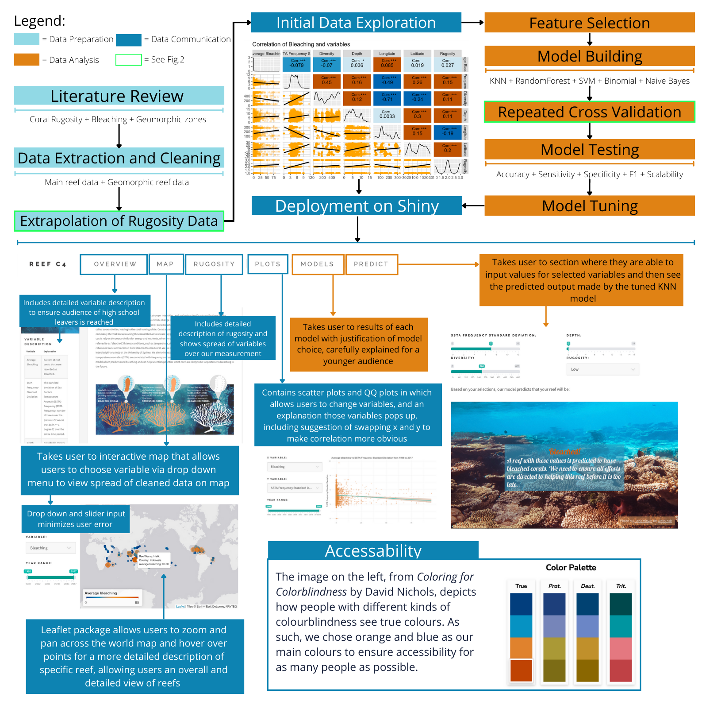
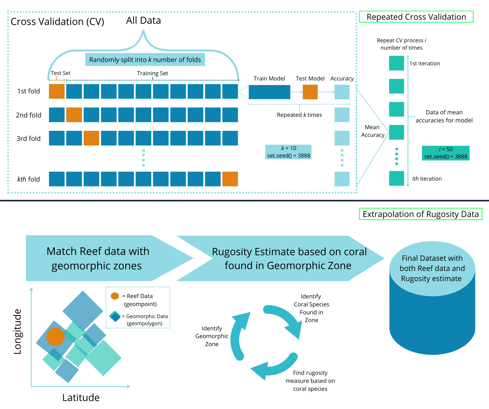

```{r setup, include=FALSE}
knitr::opts_chunk$set(echo = TRUE)

library(tidyverse)
library(sf)
library(ggplot2)
library(maps)
library(viridis)
library(dplyr)
library(gt)
```

# Executive summary

Corals are an extremely important part of the reef ecosystem, not only providing essential habitat and nutrients to the sea-life that inhabit reefs [@Cole_2008], but also providing protection for coastlines [@Harris_2018], and contributing to a multi-billion dollar industry that over half a billion people rely on [@NOAA_2019]. However, coral bleaching events are occurring more frequently, at stronger intensities, and are having significant ramifications for the mortality of coral reefs [@Williams_1990; @Hoegh_Guldberg_2007]. Climate change is leading to more profound changes in the physical ocean environment which, in turn, leads to these mass bleaching events [@Douglas_2003]. This study aimed to investigate the factors that contribute to coral bleaching and present them in an interactive app that was aimed at high-school leavers to educate them on the complexity of predicting coral bleaching, as well as visualize the areas that are most susceptible to coral bleaching. We aimed to test different models that could potentially help predict bleaching, testing classifiers as well as linear models. We used a repeated cross validation technique, as well as multiple model metrics to determine our final model. We focused on rugosity as a variable, as it has yet to be extensively researched, to determine if it was a significant factor for coral bleaching. We were able to construct a rugosity measure based on geomorphic zones and coral types. We found that with our current estimate of rugosity, it was not significant. Our final model used a KNN classifier that was able to predict bleaching with an accuracy of 66%. While we acknowledge this is not a high accuracy, we hope our Shiny app provides a solid background for understanding coral bleaching and what rugosity is, and our suggestions for future studies are taken on. 

# Aim and Background 

Coral bleaching refers to when corals expel their symbiotic algae, called zooxanthellae, leading to the coral turning white. Corals expel their algae when they become stressed (most commonly due to thermal stress) causing the zooxanthellae to release oxygen free radicals that damage coral tissue. Since the corals rely on the zooxanthellae for energy and nutrients, when the zooxanthellae is lost the corals turn white and are referred to as ‘bleached’. If stress conditions such as temperature do not return to normal conditions, zooxanthellae will not return and coral will transition from bleached to dead coral [@Douglas_2003].

A known factor contributing to coral bleaching is sea surface temperature anomalies (SSTA) [@Sully_2019]. The greenhouse effect has increased ocean temperature [@Hughes_2018], as well as intensity and frequency of heat waves [@Kayanne_2017], leading to large-scale thermal stress and numerous corals expelling their zooxanthellae resulting in mass bleaching. Therefore, we expected to find a correlation between bleaching and sea surface temperature anomalies. 

The impact that diversity has on bleaching is less explored. Diversity and coral bleaching have a complex feedback relationship where coral bleaching impacts diversity of reefs, and the diversity of coral reefs impacts the chances of a reef to bleach. In the long term, bleaching results in lower genetic diversity of coral reefs. This is because some species of coral are more affected than others and species that have already been bleached do not have enhanced resistance to future bleaching events [@Loya_2001]. However, we expect more diverse reefs to experience less bleaching since higher genetic diversity leads to higher general resilience against not only increases in sea surface temperature, but also other causes of bleaching such as: pollution, disease, sedimentation, freshwater flooding and changes in light [@West_2003]. 

Another complex factor potentially contributing to coral bleaching is coral rugosity. The structural complexity of coral reefs can be quantified using rugosity which is measured through laying a chain over the surface of coral reefs and measuring the amount of chain needed to cover the distance between two points [@Dustan_2013]. Studies across the Great Barrier Reef (GBR) found that a higher percentage of more rugose branching corals were bleached compared to large plate (less rugose) corals [@Loya_2001]. This suggests that more structurally complex reefs could be more vulnerable to bleaching. Further research, by @Ferrari_2016, involved reconstructing 3D coral reefs and testing the effect of thermal stress. Ferrari et al. found that with more bleaching the structural complexity of the reef instead increased. Ferrari et al. and Loya et al. therefore suggest opposing relationships between rugosity and bleaching. The relationship between rugosity and bleaching has not been deeply explored in scientific literature and scientists are still unsure of the complex relationship. However, current research indicated that more rugosity would be best able to mitigate the effects of bleaching [@Magel_2019; @Ferrari_2016]. 

In order to prioritise which reefs we need to allocate conservation resources to, it is crucial to gain a deeper understanding as to what factors contribute significantly to coral bleaching. Therefore, we aimed to use data extracted from the [Allen Coral Atlas](https://allencoralatlas.org/atlas/) combined with the dataset from the paper ["A global analysis of coral bleaching over the past twodecades"](https://doi.org/10.1038/s41467-019-09238-2) by @Sully_2019 to develop a model which predicts coral bleaching using coral reef sea surface temperature frequency standard deviation (SSTA_freq_sd), diversity, and rugosity. We aimed to deploy this model via Shiny intended to help scientists visualise the model and the areas of bleaching to focus on. 


# Method



## Data Extraction

As we wanted to explore all the reefs globally, we extracted reef data containing the bleaching, diversity, SSTA_Frequency_STD, and other metrics from the public dataset taken from the paper ["A global analysis of coral bleaching over the past twodecades"](https://doi.org/10.1038/s41467-019-09238-2) by @Sully_2019. The paper contains coral bleaching events at 3351 sites in 81 countries from 1998 to 2017. The raw data can be found at the [Reef Check website](https://www.reefcheck.org/) or on the GitHub repository for the [Institute for Global Ecology](https://github.com/InstituteForGlobalEcology/Coral-bleaching-a-global-analysis-of-the-past-two-decades).

As there is no current worldwide database for coral rugosity, we used data gathered from [Allen Coral Atlas](https://allencoralatlas.org/atlas/) to build our rugosity dataset. The full dataset was downloaded locally to be processed as the zipped archive was over 13GB. The files extracted contained the geomorphic map data that was in the shape files `geomorphic.gpkg` or `.geojson`. From investigation of the data sets on the map, it looked like the Reef Check dataset (containing a single point of data for each reef) was not as precise as the Allen Coral dataset (containing extensive polygon data for each reef) - hence points not touching some polygons (see Fig.2). As such, we decided to keep only the points from the Reef Check dataset that fell within the polygons of Allen Coral Atlas to limit uncertainty. We were interested in the geomorphic data as we found that the rugosity of a reef is associated with its geomorphic type [@Sheppard_1980; @Thornborough_2011; @Kennedy_2021]. On the basis of this association, we created our own rugosity measure (`Low[1]`, `Medium[2]`, `High[3]`) and generated a value for each reef, using the rugosity estimates to investigate whether rugosity might have an impact on our bleaching model. Full extraction method can be found [here](https://github.com/camille-alice/MARS_DATA3888_reefC4/blob/main/camille_ida.Rmd). 

## Model Development 

As the Reef Check dataset contained other metrics, we decided to see if any other variables were significant to bleaching. We found that depth and latitude could also potentially be significant so we kept them in our final dataset which can be found [here](https://github.com/camille-alice/MARS_DATA3888_reefC4/blob/main/app_reef/Data/reef_final.gpkg). We decided to choose a range of models to compare as we had multiple features to choose from and a relatively large dataset. We started with Binomial Regression as that’s what was used by @Sully_2019, but also decided to test out K-nearest neighbour (KNN), Random Forest, Support Vector Machine (SVM), and Naive Bayes. As such, we first conducted variable testing to ensure our data met the assumptions for each model, performing a variance inflation factor (VIF) test for each variable, as well as testing for normality and independence, as shown in Fig.1. 

**Binomial regression** is very similar to linear regression however, instead of predicting numeric output it predicts categorical output by weighting differently every independent variable. 

**KNN** classifies points close together in a dataset that are typically similar. It classifies a point class by calculating the distance between a test point and all the training points and selects the K number of the closest neighbouring points and takes the majority vote from that group of K points. 

**Naive Bayes** classifies a point based on Bayes theorem where it calculates the conditional probability, which measures the probability of an event occurring given that another event has occurred. 

**Random Forest** classifies by creating multiple decision trees to create a forest and then chooses the outcome based on which outcome most trees land on.

**SVM** classifies by dividing classes via an optimal hyper plane and using data points closest to the hyper plane as support vectors to measure the direction and orientation of the hyper plane. 

For each model we used cross-validation (CV) setting the number of folds to 10 and then repeating 50 times. By using the repeated CV technique, we can obtain a more accurate mean estimate as we are using every part of the data as test and training data.Full method can be seen in Fig.2. We also compared sensitivity (true positive rate) and specificity (true negative rate), model stability by using the models mean standard deviation (sd), as well as scalability, comparing model running times. We then repeated this process with all the variables except rugosity, to measure if our rugosity measurement was significant. Once our model was selected, we then went on to hyperparameter tuning to ensure the best results could be achieved. Full model method can be found on our GitHub page [here](https://github.com/camille-alice/MARS_DATA3888_reefC4/blob/main/GroupAssignment_pat.Rmd).



Our Shiny app was built using the RShiny [htmlTemplate](https://shiny.rstudio.com/articles/templates.html) package and deployed via [shinyapp](https://www.shinyapps.io/). The front-end design used the Bootstrap framework for better usability and modularity across a wide range of devices. The app is available [here](https://camille-alice.shinyapps.io/app_reef/). Our main priorities in designing the app were communicability to our target audience, and interactivity. Our target audience were recent high-school leavers who may have an interest in marine science, specifically, coral bleaching. As such, the vocabulary used was targeted at a high-school level and key concepts such as bleaching and rugosity were thoroughly explained. 

# Results 
```{r Reading in Data, message=FALSE, results=FALSE}
# cleaned file to use for app - no warnings and less computationally expensive
reef_geomorphic = st_read("Data/reef_final.gpkg")
reef_final = reef_geomorphic %>% 
  as.data.frame()

reef_final = reef_final %>% 
  drop_na() %>% 
  mutate(class = as.factor(class)) %>%
  mutate(rugosity = factor(rugosity, levels = c("Low", "Medium", "High")))

# File with all the results from model testing (so we don't have to run the models here)
# Full model code can be found in the appendix
model_results = load("Data/model_results.rds")
```
## Variable Testing of Model Assumptions 

Each variable had a VIF score less than 5, indicating multicollinearity would be unproblematic for the models. We also used a test of independence, with the null hypothesis of rugosity having no association with bleaching and alternative hypothesis of rugosity having association with bleaching. Checking the independent test assumption, every variable needed to have a value greater than 5, which all variables did, hence the assumption was met. A chi-square independent test gave us a p-value of 0.067 which is slightly over 0.05, so we decided to retain the null hypothesis.

```{r fig2, fig.width=12,fig.height=6,fig.cap="Figure 3. Violin-Boxplot of Model accuracies"}
# Fig.2: Violin plot
# Extracting model accuracy from model_results
v_data = cbind(cv_50acc5_bin, cv_50acc5_sel, cv_acc50_svm, 
             cv_acc50_NB, cv_acc50_knn, cv_acc50_rf) %>%
  as.data.frame() %>%
  rename("Initial Binomial Regression" = cv_50acc5_bin,
         "Final Binomial Regression" = cv_50acc5_sel,
         "Support Vector Machine" = cv_acc50_svm,
         "Naive Bayes" = cv_acc50_NB,
         "K-Nearest Neighbours" = cv_acc50_knn,
         "Random Forest" = cv_acc50_rf) %>%
  gather()

v_data %>%
  ggplot(aes(x=reorder(key,value,na.rm = TRUE), y=value, fill=reorder(key,value,na.rm = TRUE))) + 
  geom_violin(alpha=0.6,trim=FALSE, position = position_dodge(width = 0.75),size=1,color=NA) +
  geom_boxplot(width=0.4, color="black", alpha=0.5,
               outlier.colour="red",
               outlier.fill="red",
               outlier.size=3, 
               show.legend = F) +
  scale_fill_manual(name = "Models", values=c("#023e7d", "#0892c3", "#4dcde4", "#e79f52", "#e0812d", "#bf4402")) +
  labs(title = "Model Accuracy", x = "Models", y = "Accuracy") +
  theme_minimal() + 
  theme(axis.text.x = element_text(angle = 45, vjust = 1, hjust = 1))
```

As seen above in Fig.3, our Random Forest model had the best accuracy when compared to other models. However, as seen below in Fig.4, the specificity (how well our model is able to predict a true negative bleaching) was not the best at 0.83, and the sensitivity (true positive) was also quite low at 0.52. Coupled with the scalability being extremely poor taking 298.42 seconds to run, we decided to use KNN as our final classifier as it had the second highest accuracy and f1-score, and the best run time. 

```{r Model Results Table, message=FALSE}
# Fig.3: Model Results Table
# Data extraction: preparing confusion matrix results with in data frame 
model_names = c("Binomial", "K-Nearest Neighbours", "Naive Bayes","Random Forest", "Support Vector Machine")

# With rugosity 
mean_accuracy = c(bin_mean, knn_mean, nb_mean, rf_mean, svm_mean)
sensitivity = c(bin_cf$byClass[1], knn_cf$byClass[1], nb_cf$byClass[1],rf_cf$byClass[1], svm_cf$byClass[1])
specificity = c(bin_cf$byClass[2], knn_cf$byClass[2], nb_cf$byClass[2],rf_cf$byClass[2], svm_cf$byClass[2])
f1_score = c(bin_cf$byClass[7], knn_cf$byClass[7], nb_cf$byClass[7],rf_cf$byClass[7], svm_cf$byClass[7])
time = c(bin_cv_time, knn_cv_time, nb_cv_time, rf_cv_time, svm_cv_time)
cf_data = cbind('Accuracy' = mean_accuracy, 'Sensitivity' = sensitivity, 'Specificity' = specificity, 
                'F1' = f1_score, 'Scalability' = time) %>%
  as.data.frame(row.names = c(1:5)) %>% 
  mutate_if(is.numeric, round, digits=2) %>%
  cbind('Type' = rep("With Rugosity", 5), 'Model' = model_names) %>%
  arrange(Accuracy, desc(Scalability))

# Without rugosity
mean_accuracy_WO = c(sel_mean, knn_mean_WO, nb_mean_WO, rf_mean_WO, svm_mean_WO)
sensitivity_WO = c(bin_sel_cf$byClass[1], knn_cf_WO$byClass[1], nb_cf_WO$byClass[1],
                rf_cf_WO$byClass[1], svm_cf_WO$byClass[1])
specificity_WO = c(bin_sel_cf$byClass[2], knn_cf_WO$byClass[2], nb_cf_WO$byClass[2],
                rf_cf_WO$byClass[2], svm_cf_WO$byClass[2])
f1_score_WO = c(bin_sel_cf$byClass[7], knn_cf_WO$byClass[7], nb_cf_WO$byClass[7],
             rf_cf_WO$byClass[7], svm_cf_WO$byClass[7])
time_WO = c(sel_cv_time, knn_cv_time_wo, nb_cv_time_wo, rf_cv_time_wo, svm_cv_time_wo)
cf_data_WO = cbind('Accuracy' = mean_accuracy_WO, 'Sensitivity' = sensitivity_WO, 'Specificity' = specificity_WO, 
                'F1' = f1_score_WO, 'Scalability' = time_WO) %>%
  as.data.frame(row.names = c(1:5)) %>% 
  mutate_if(is.numeric, round, digits=2) %>%
  cbind('Type' = rep("Without Rugosity", 5), 'Model' = model_names) %>%
  arrange(Accuracy, desc(Scalability))
cf_data_all = rbind(cf_data, cf_data_WO)

# Table visualisation
cf_metrics= c('Accuracy', 'Sensitivity', 'Specificity', 'F1')
cf_colours = scales::col_numeric(palette = c("#023e7d", "#0892c3", "#4dcde4", "#80cdc4", "#e79f52", "#e0812d", "#bf4402"), 
                                 as.character(), domain = NULL)
cf_colour_r = scales::col_numeric(palette = c("#bf4402", "#e0812d", "#e79f52", "#80cdc4", "#4dcde4", "#0892c3", "#023e7d"), 
                                 as.character(), domain = NULL)
cf_data_all %>%
  group_by(Model, Type) %>%
  gt(rowname_col = "Type",
    groupname_col = "Model") %>%
   tab_header(title = md("**Model Results**"),
              subtitle = md("*Best* performing in **orange** - *worst* in **dark blue**")) %>%
  tab_style(locations = cells_column_labels(columns = everything()), 
            style = list(cell_borders(sides = "bottom", weight = px(0.5)),
                         cell_text(weight = "bold"))) %>% 
    tab_style(locations = cells_row_groups(), 
            style = list(cell_borders(sides = "bottom", weight = px(0.5)),
                         cell_text(weight = "bold"))) %>% 
  tab_options(column_labels.border.top.width = px(3),
              column_labels.border.top.color = "transparent",
              table.border.top.color = "transparent",
              table.border.bottom.color = "transparent",
              data_row.padding = px(3),
              heading.align = "left") %>%
  cols_width(cf_metrics ~ px(125),
             c(Type) ~ px(150),
              c(Scalability) ~ px(125)) %>% 
  cols_label(Scalability = html("Scalability (secs)")) %>%
  data_color(columns = cf_metrics,
             alpha = 0.7,
             colors = cf_colours,
             autocolor_text = FALSE) %>%
  data_color(columns = 'Scalability',
             alpha = 0.7,
             colors = cf_colour_r, 
             autocolor_text = FALSE) %>% 
  tab_source_note(source_note = md("Figure 4. Table of Model Results comparing Rugosity"))
```


We also tuned our k-value for our KNN model by running our model with different k-values and seeing which had the best accuracy. As shown below in Fig.5, our best k-value was k=9 as per indicated by the orange line. 

```{r KNN Hyperparameter Tuning, fig.width=12,fig.height=5, fig.cap="Figure 5. Plot of Hyper-parameter testing for KNN, with orange line indicating best k-value"}
ggplot(knn_fit) + 
  labs(title = "KNN Hyper-parameter tuning", x = "K Value", y = "Accuracy") +
  geom_point(color="#80cdc4", alpha = 1) +
  geom_vline(xintercept = 9, color = '#bf4402') + 
  theme_minimal()
```

## Shiny

The app included an interactive map that displayed the value of the variables Bleaching, SSTA Frequency Standard Deviation, Diversity, Depth. We also included the correlation between these variables as well as normality assumptions for transparency. Furthermore, a correlation between those variables and Rugosity was added in the form of violin-boxplots. These plots and variables were chosen as they were utilised in our models, so we wanted to allow our audience an opportunity to explore the data themselves. Moreover, we included the results from our model testing for transparency and to explain why we decided to select the KNN model. Finally, we added an interface where the user could select the value of variables in order to make a prediction based on our model. Each section was accompanied with a thorough explanation based on the variables the user selected to ensure our target audience was reached. 

# Discusssion

KNN is fastest due to computing the distance for neighbouring groups, and clustering based on distance, rather than training the model as Naive Bayes and Binomial models need to do. Random Forest and Support Vector Machine are the slowest due to having multiple prediction vectors having to be calculated, and then used to train the model. We believe our best KNN model used a lower k-value (K=9) as the higher the K value, the more prone to overfitting the model is. 

While the deployment of the Shiny app was successful, our best model was still only able to predict coral bleaching with only 67% accuracy. We believe this is due to the multiple factors contributing to coral bleaching, making it extremely difficult to predict. As shown in our model results in Fig.4, our models were only able to predict bleaching with a maximum of 72% accuracy. This was marginally better than our KNN accuracy, however with a significantly higher run time. This is indicative of how difficult it is to predict coral bleaching with a high accuracy with our dataset. While our rugosity measurement was not significant in our model, we attribute this to our measure being rudimentary. Another concern about the Shiny app is future scalability. Our app currently does not utilise any caching and instead relies on reading and running some data at start-up. The interactive plots and prediction also require rerunning each time a change is made, so scalability is a significant concern in the future. For the purposes of this project, there were no issues as our data was relatively small. Due to our usage of the Bootstrap framework in designing the front-end, our app is well-modulated and new features can be easily added in the future. For example, if new research or new data is discovered, or user feedback suggests that a particular experience can be improved, then our app can be easily updated to include these features. 

# Conclusion

We were able to successfully deploy a Shiny app that educated high-school leavers about coral bleaching and its potential predictive factors. We were able to develop a model that could be used as a baseline for predicting coral bleaching. However, for future work, a more robust measure of rugosity is needed for measurement. We would also like to highlight the need for a standardised rugosity measurement, as currently the chain method is extremely time consuming and ineffective on a large scale. While a KNN model could potentially be used in future studies to predict bleaching, we believe more attributes may need to be added to improve on accuracy of classifying. Another area of future improvement could be runtime as we only worked with a relatively small dataset, as more data is collected and added, this will impact on the runtime. 

# Student Contributions

As per our [GitHub page](https://github.com/camille-alice/MARS_DATA3888_reefC4) Patrick, Nathan, and Camille all did the initial data exploration and tried different methods of data extraction. Patrick then went on to do the code for the model, while Nathan did the base of Shiny app, and writing the report, and Camille doing the leaflet map, formatting Shiny, and writing the report. Alex, Kathryn, and Daniel all contributed to the literature review and rugosity measurement, as well as helping with observations in the data. 

# References 

<div id="refs"></div>


**Packages Used:**

```{r Libraries Used}
(.packages())
```

# Appendix


